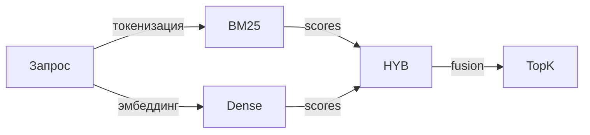
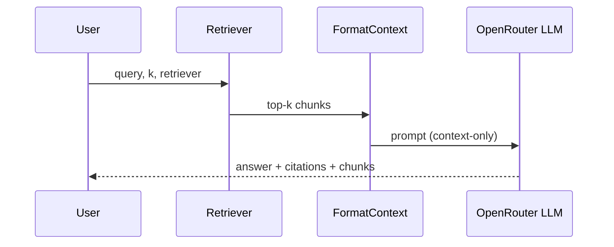
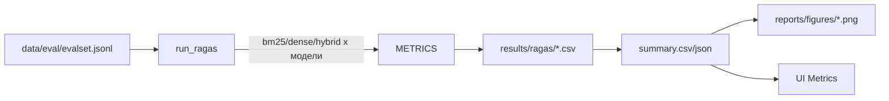
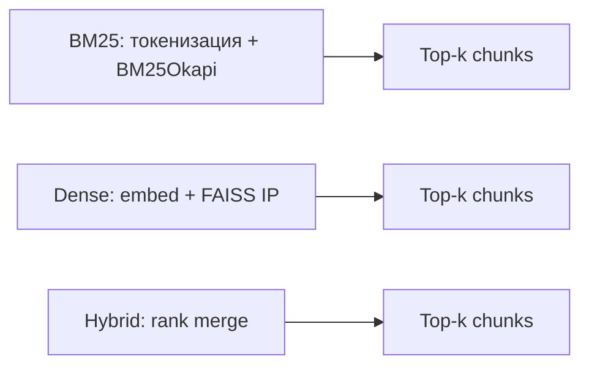
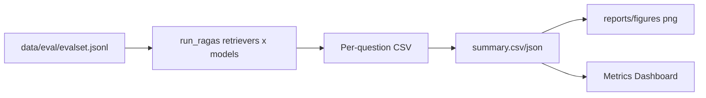
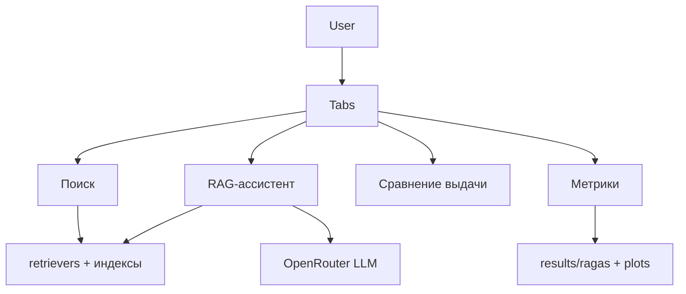

# RusLawOD RAG — учебный MVP

Этот репозиторий — учебный MVP Retrieval-Augmented Generation (RAG) по русскоязычным юридическим текстам RusLawOD. Проект демонстрирует полный цикл: от загрузки и нарезки корпуса до сравнительной оценки нескольких стратегий retrieval, построения графиков и интерактивного UI (Streamlit) с режимом поиска и RAG-ответов.

## Обзор целей и ограничений
- **Цель**: показать воспроизводимый, офлайн-ориентированный baseline RAG на русских юридических текстах.
- **Корпус**: RusLawOD (HuggingFace, `irlspbru/RusLawOD`), локальный срез (`data/raw/ruslawod_slice.jsonl.gz`).
- **Retrieval-стратегии**: BM25, Dense (FAISS + sentence-transformers), Hybrid.
- **Оценка**: RAGAS (context_precision / context_recall) + кастомные метрики (hit@k, doc_hit@k).
- **UI**: Streamlit с вкладками Retrieval Explorer, RAG-ассистент, Diff (сравнение выдачи), Metrics Dashboard.
- **Офлайн по умолчанию**: retrieval и метрики работают без сети; загрузки моделей/датасета — явный опциональный шаг.

## Архитектура (Mermaid)
```mermaid
graph TD
    A[HF slice .jsonl.gz] --> B[Нормализация → Document]
    B --> C[Chunking]
    C --> D[Индексы BM25]
    C --> E[Индексы FAISS Dense]
    D --> F[Hybrid Fusion]
    E --> F
    F --> G[Retrieval API/CLI/UI]
    G --> H[RAG Answer (LLM + citations)]
    G --> I[Оценка RAGAS/метрики]
```

### Модули (папки)
- `src/rag/ingest`: загрузка HF, нормализация, чанкинг.
- `src/rag/index`: BM25, FAISS Dense, Hybrid, контракты.
- `src/rag/embeddings`: конфиг моделей, загрузка sentence-transformers с кэшем.
- `src/rag/rag_pipeline`: форматирование контекста, цитаты, RAG-ответ.
- `src/rag/llm`: OpenRouter клиент, промпты.
- `src/rag/eval`: метрики, RAGAS runner, loader результатов.
- `ui/streamlit_app.py`: UI (поиск, RAG, diff, метрики).
- `scripts/*.py`: консольные entrypoint’ы (ингест, eval, генерация evalset, графики).

## Data pipeline
### HF slice (Phase 1.5)
- Скрипт: `scripts/hf_slice.py`
- Команда: `make hf-slice` (network, optional)
- Параметры (env/CLI): `DATASET_ID`, `SPLIT`, `N`, `SEED`, `STRATEGY=download|stream`, `DATA_FILES`, `STATUS_FILTER`, `DOC_TYPE_FILTER`, `OUTPUT_DIR`
- Артефакты:
  - `data/raw/ruslawod_slice.jsonl.gz` — gzip JSONL, нормализованные записи (doc_id, text, metadata, title)
  - `data/raw/slice_manifest.json` — параметры запуска, дата, фильтры
- Особенности: ретраи, уважение HF_HOME/каша, режим `stream` не поддерживает split с `:`, по умолчанию download.

### Нормализация
- Функция: `normalize_ruslawod_record` (ingest pipeline)
- Schema Document: `doc_id`, `title`, `text` (нормализованный `textIPS`), `metadata` (doc_type, docdate, doc_number, status, keywords и др.)

### Чанкинг (Phase 2)
- Модуль: `src/rag/ingest/chunking.py`
- Стратегия: структурные разделители (`\n\n`, номера пунктов, “Статья/Глава/Раздел”) + fallback на фиксированный размер.
- Параметры: `chunk_size_chars` (по умолчанию 1024 или задаётся), `overlap_chars` (64), `min_chunk_chars` (обычно 50 для dense).
- Метаданные переносятся в каждый Chunk: `chunk_id` (детерминированный), `char_start/char_end`, `metadata` документа.

## Retrieval

- **BM25**: `src/rag/index/bm25.py`, русская токенизация через `re.split(r"\W+")`, детерминированная. `BM25Retriever.from_chunks` валидирует непустой корпус.
- **Dense (FAISS)**: `src/rag/index/faiss_dense.py`, индекс `IndexFlatIP` с L2-нормализацией, проверка dim>=32. Эмбеддер: `SentenceTransformerEmbeddings` (E5/MiniLM), кэш в `data/cache/embeddings`, `local_files_only` — скачивание только при `EMBEDDING_ALLOW_DOWNLOAD=true`.
- **Hybrid**: линейное слияние BM25 и Dense после нормализации скорингов (rank/min-max), веса фиксированы (0.5/0.5), детерминированный порядок.
- **Контракт**: `Retriever.retrieve(query, k) -> List[RetrievedChunk]` (doc_id, chunk_id, text, metadata, score).

## RAG answering (LLM + citations)

- Форматирование контекста: `format_context(chunks, max_chars=16000, per_chunk_chars=1800)` — нумерация, doc_id, title, docdate, chunk_id, обрезка текста.
- Цитаты: `build_citations` — дедуп по doc_id, сортировка по лучшему score, поля doc_id/title/docdate/doc_type/doc_number.
- Промпт: контекст-ориентированный, fallback: **"Недостаточно информации в предоставленном контексте."**
- Ответ (`RagResponse`): `answer` (markdown), `citations` (list[dict]), `retrieved_chunks` (для дебага/демо).
- LLM клиент: `src/rag/llm/openrouter.py` — таймаут, ретраи на 429/5xx с backoff, отдельные env для RAG: `RAG_OPENROUTER_*` (подробно ниже).

## Оценка и метрики

- Evalset: JSONL, поля `question`, `gold_doc_ids`, `gold_chunk_ids` (может быть пустым для negative).
- Retrieval-only метрики (кастом): hit@k, doc_hit@k, precision@k, recall@k — см. `src/rag/eval/retrieval_metrics.py`.
- RAGAS (Phase 7): ID-based `context_precision`, `context_recall` (без LLM). Поддержка нескольких embedding моделей: summary включает `embedding_model`.
- Метрики загрузчик: `src/rag/eval/metrics_loader.py` — рекурсивно читает CSV, подставляет embedding_model="none", игнорирует per-question CSV.
- Графики/таблицы: `scripts/analysis/plot_retrieval_metrics.py` → `reports/figures/*.png`, `reports/tables/retriever_comparison.*`.
- Методология метрик (Phase 6.5): см. `docs/retrieval_metrics_methodology.md`.

## UI (Streamlit)
```mermaid
graph TD
    User --> Tabs[Вкладки UI]
    Tabs --> Explorer[Поиск (retrieval)]
    Tabs --> RAG[RAG-ассистент]
    Tabs --> Diff[Сравнение выдачи]
    Tabs --> Metrics[Метрики/графики]
    Explorer --> Retrievers
    RAG -->|rag_answer| LLM
    Diff --> Retrievers
    Metrics -->|load CSV| Reports
```
- Запуск: `make ui`
- Вкладки:
  - **Поиск (retrieval)**: выбор retriever, chunk_size/overlap, выдача чанков по doc_id.
  - **RAG-ассистент**: выбор retriever, k, embedding model (для dense/hybrid), LLM model (из `RAG_OPENROUTER_MODELS`/`RAG_OPENROUTER_MODEL`), ответ + цитаты + чанки, latency.
  - **Сравнение выдачи**: A vs B (retriever + embedding), пересечение doc_id.
  - **Метрики**: фильтры k/retriever/metric/embedding_model, таблицы и bar chart сравнения.
- Светлая тема с голубыми акцентами (`.streamlit/config.toml`).
- Предупреждение для dense/hybrid: при отсутствии модели и `EMBEDDING_ALLOW_DOWNLOAD` UI покажет понятную ошибку.

## API (FastAPI)
- Скрипт `scripts/serve.py` подключает `setup_logging`; текущий роут `/retrieve` в `src/rag/api/routes.py` — минимальный BM25 по фикстуре (заглушка). Основной интерактив — через Streamlit/CLI. Расширение FastAPI — зона для будущей работы.

## Команды и сценарии
```bash
# Установка и запуск
make venv
make sync

# Форматирование / линт / тесты
make fmt       # format + lint-fix
make lint      # ruff check
make test      # pytest без network/slow
make test-network  # включает @network

# Срез HF (network, опционально)
make hf-slice DATASET_ID=irlspbru/RusLawOD SPLIT=train N=2000 STRATEGY=download

# Каталог документов / evalset
make docs-catalog
make evalset-draft
make evalset-autolink
# LLM-assisted draft (network)
make evalset-llm

# Retrieval CLI
make retrieve QUERY="налог" RETRIEVER=bm25 K=10 CHUNK_SIZE_CHARS=1024 OVERLAP_CHARS=64

# Dense/Hybrid индексы и метрики
make eval-ragas RETRIEVERS=bm25,dense,hybrid K=5
make analyze-metrics

# UI
make ui

# Демо-ноутбук (Jupyter)
make demo-notebook  # откроет Jupyter Lab, ноутбук notebooks/RAG_RusLaw_Demo.ipynb
```

## Быстрый старт (минимум шагов)
1. `make venv && make sync`
2. Убедитесь, что `data/raw/ruslawod_slice.jsonl.gz` существует (если нет — `make hf-slice` при наличии сети).
3. Запустите офлайн поиск: `make retrieve QUERY="налог" RETRIEVER=bm25 K=5`.
4. Запустите UI: `make ui` → вкладка “Поиск” (работает без сети). Для RAG вкладки — нужен OpenRouter ключ/модель и скачанные эмбеддинги.
5. Аналитика метрик: `make analyze-metrics` (использует `results/ragas/summary.csv`).

## Конфигурация (env)
Пример `.env` (см. `.env.example`):
```bash
# HuggingFace / кэш
HF_HOME=~/.cache/huggingface
TRANSFORMERS_CACHE=data/cache/embeddings
SENTENCE_TRANSFORMERS_HOME=data/cache/embeddings
EMBEDDING_ALLOW_DOWNLOAD=false   # true только при первом скачивании

# Embeddings
EMBEDDING_MODEL_DEFAULT=intfloat/multilingual-e5-small
EMBEDDING_MODELS=sentence-transformers/paraphrase-multilingual-MiniLM-L12-v2,sentence-transformers/paraphrase-multilingual-MiniLM-L6-v2,intfloat/multilingual-e5-small
EMBEDDING_BATCH_SIZE=32
MIN_CHUNK_CHARS=50

# OpenRouter для RAG (отдельно от RAGAS)
RAG_OPENROUTER_API_KEY=...
RAG_OPENROUTER_MODEL=openai/gpt-oss-120b
RAG_OPENROUTER_MODELS=openai/gpt-oss-120b,mistralai/devstral-2512,google/gemini-2.5-flash-lite
RAG_OPENROUTER_BASE_URL=https://openrouter.ai/api/v1
RAG_OPENROUTER_TIMEOUT_S=45
RAG_OPENROUTER_MAX_RETRIES=4
RAG_OPENROUTER_BACKOFF_BASE=1.8

# OpenRouter для RAGAS (если нужно)
OPENROUTER_API_KEY=...
OPENROUTER_MODEL=...
OPENROUTER_BASE_URL=https://openrouter.ai/api/v1

# Логирование
LOG_LEVEL=INFO
LOG_FILE=logs/app.log   # опционально
```

## Результаты и артефакты
- Retrieval метрики (per-question): `results/ragas/*_k*.csv`
- Summary (mean/std, с embedding_model): `results/ragas/summary.csv/json`
- Графики/таблицы: `reports/figures/*.png`, `reports/tables/*.csv/.md`
- Каталог документов: `data/eval/docs_catalog.csv`
- Evalset: `data/eval/evalset.jsonl` (draft/auto/llm варианты в `data/eval/`)
- Чанк-статистика: `data/metrics/chunk_stats.json`

## Troubleshooting
- **HF slice скачивается с ошибками (ChunkedEncoding/IncompleteRead)**: используйте `STRATEGY=download`, `DATA_FILES` для узких shard, переменные `HF_HUB_DOWNLOAD_TIMEOUT`, `HF_HOME`, ретраи уже встроены.
- **split с двоеточием в stream**: недопустимо (`train[:N]` нельзя в `strategy=stream`), используйте `strategy=download`.
- **Модель эмбеддингов не найдена**: проверьте кэш в `data/cache/embeddings`; для первой загрузки выставьте `EMBEDDING_ALLOW_DOWNLOAD=true` при наличии сети и нужные `TRANSFORMERS_CACHE/SENTENCE_TRANSFORMERS_HOME`. После скачивания верните `false` для офлайна.
- **429 / rate limit OpenRouter**: клиент делает ретраи с backoff. При частых 429 — уменьшите частоту запросов, проверьте ключ/тариф.
- **Segmentation fault / OpenMP**: установите `OMP_NUM_THREADS=1`, `KMP_DUPLICATE_LIB_OK=TRUE` (уже задаётся в коде и tests/conftest.py).
- **Pytest “deselected”**: по умолчанию запускается `-m "not network and not slow"`. Для сетевых тестов используйте `make test-network`.
- **UI пустой список моделей LLM**: убедитесь, что `RAG_OPENROUTER_MODEL` или `RAG_OPENROUTER_MODELS` заданы, `.env` загружается через `load_dotenv()`.
- **Dense/Hybrid в UI падает**: проверьте наличие эмбеддингов; если кэша нет — включите `EMBEDDING_ALLOW_DOWNLOAD=true` и перезапустите с сетью.

## Расширение и план
- Roadmap: `ROADMAP.md` (фазы 1–11, текущий прогресс), история изменений — `CHANGELOG.md`, правила — `AGENTS.md`.
- Расширение FastAPI (реальный /query) и дополнительные метрики/графики — будущая работа.
- Возможные next steps: улучшение prompt’ов, оптимизация FAISS, добавление hybrid весов, экспорт результатов для отчётов.

## Дополнительные Mermaid диаграммы
### End-to-end пайплайн
```mermaid
graph TD
  HF[HuggingFace RusLawOD] --> SLICE[HF Slice Builder]
  SLICE --> NORM[Normalize → Document]
  NORM --> CHUNK[Chunking]
  CHUNK --> IDX1[BM25 Index]
  CHUNK --> IDX2[FAISS Dense]
  IDX1 --> HYB[Hybrid]
  IDX2 --> HYB
  HYB --> RETRIEVE[Retrieval (CLI/UI/API)]
  RETRIEVE --> RAG[RAG Answer (LLM+citations)]
  RETRIEVE --> EVAL[Metrics/RAGAS]
```

### Сравнение стратегий retrieval


### Оценка (RAGAS + кастом)


### UI взаимодействие


---
README покрывает основные модули, команды и подводные камни. Для деталей фаз см. `ROADMAP.md`; для изменений — `CHANGELOG.md`; для правил — `AGENTS.md`. README готов для включения в отчёт и демонстрации преподавателю. 
