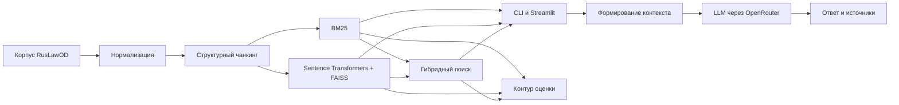

# 📑 RAG-система «Русло»

**RAG-система для поиска и Q&A взаимодействия по русскоязычным юридическим документам.**

«Русло» объединяет подготовку корпуса [RusLawOD](https://huggingface.co/datasets/irlspbru/RusLawOD), лексический, векторный и гибридный поиск, генерацию ответов с указанием источников и сравнительную оценку retrieval-стратегий. Проект включает воспроизводимый пайплайн подготовки данных, CLI-инструменты, интерактивный интерфейс на Streamlit и отдельный контур оценки качества поиска.

## Возможности

- детерминированная подготовка среза RusLawOD с манифестом запуска;
- нормализация и структурный чанкинг юридических документов;
- BM25, dense retrieval на основе FAISS и гибридный поиск;
- поддержка мультиязычных Sentence Transformers;
- генерация ответов через OpenRouter на основе найденного контекста;
- отображение документов-источников и использованных фрагментов;
- сравнение retrieval-конфигураций в Streamlit;
- оценка качества поиска на уровне документов и чанков;
- формирование сводных таблиц и графиков экспериментов;
- автоматические тесты основных компонентов пайплайна.

## Архитектура


```mermaid
flowchart LR
    D[Корпус RusLawOD] --> N[Нормализация]
    N --> C[Структурный чанкинг]
    C --> B[BM25]
    C --> F[Sentence Transformers + FAISS]
    B --> H[Гибридный поиск]
    F --> H
    B --> U[CLI и Streamlit]
    F --> U
    H --> U
    U --> R[Формирование контекста]
    R --> L[LLM через OpenRouter]
    L --> A[Ответ и источники]
    B --> E[Контур оценки]
    F --> E
    H --> E
```

Пайплайн разделён на независимые компоненты подготовки данных, индексации, retrieval, генерации и оценки. Это позволяет сравнивать стратегии поиска на одном корпусе и использовать retrieval отдельно от LLM-генерации.

### Стратегии поиска

| Стратегия | Реализация | Назначение |
|---|---|---|
| **BM25** | `rank-bm25` | Лексический поиск по совпадениям терминов |
| **Dense** | Sentence Transformers + `FAISS IndexFlatIP` | Семантический поиск по эмбеддингам |
| **Hybrid** | Объединение нормализованных рангов BM25 и Dense | Совмещение лексической и семантической релевантности |

Для dense retrieval используются L2-нормализованные эмбеддинги. Запросы и документы кодируются отдельно, включая префиксы `query:` и `passage:` для моделей семейства E5. Гибридный retriever объединяет расширенные выборки BM25 и Dense с равными весами и возвращает итоговый top-k.

## Быстрый старт

### Требования

- Python 3.11 или 3.12;
- [uv](https://docs.astral.sh/uv/);
- Make;
- Git.

### Установка

```bash
git clone https://github.com/berberberk/rag-ruslaw.git
cd rag-ruslaw

uv sync
```

### Подготовка корпуса

```bash
make hf-slice N=2000 STRATEGY=download
```

Команда загружает срез RusLawOD, нормализует записи и сохраняет данные вместе с параметрами запуска:

```text
data/raw/ruslawod_slice.jsonl.gz
data/raw/slice_manifest.json
```

### Поиск через CLI

BM25 работает без загрузки модели эмбеддингов:

```bash
make retrieve \
  QUERY="налоговый вычет" \
  RETRIEVER=bm25 \
  K=5 \
  CHUNK_SIZE_CHARS=1024
```

Для векторного поиска при первом запуске разрешите загрузку модели в локальный кэш:

```bash
EMBEDDING_ALLOW_DOWNLOAD=true \
EMBEDDING_MODEL=intfloat/multilingual-e5-small \
make retrieve \
  QUERY="порядок расторжения договора" \
  RETRIEVER=dense \
  K=5 \
  CHUNK_SIZE_CHARS=1024
```

Для гибридного поиска замените `RETRIEVER=dense` на `RETRIEVER=hybrid`. После первой загрузки модель сохраняется в `data/cache/embeddings` и может использоваться локально.

## Streamlit-интерфейс

```bash
make ui
```

Интерфейс включает четыре режима:

- **Поиск** — просмотр top-k фрагментов, score и метаданных документов;
- **RAG-ассистент** — генерация ответа по найденному контексту;
- **Сравнение выдачи** — сопоставление двух retrieval-конфигураций;
- **Метрики** — просмотр таблиц и графиков экспериментов.

Параметры чанкинга, retriever, top-k и embedding-модель можно менять непосредственно в интерфейсе.

## RAG-ответы

Для генерации используется OpenRouter-совместимый API. Задайте ключ и идентификатор доступной модели:

```bash
export RAG_OPENROUTER_API_KEY="your-api-key"
export RAG_OPENROUTER_MODEL="provider/model-name"

make ui
```

RAG-пайплайн:

1. получает top-k фрагментов выбранным retriever;
2. формирует ограниченный по размеру контекст с идентификаторами документов и чанков;
3. передаёт вопрос и контекст в LLM;
4. возвращает ответ, список документов-источников и использованные фрагменты.

Промпт ограничивает генерацию предоставленным контекстом и задаёт фиксированный fallback для случаев, когда найденных данных недостаточно.

## Подготовка документов

Записи RusLawOD приводятся к единой схеме `Document` с текстом, заголовком, идентификатором и метаданными. В метаданных сохраняются тип документа, дата, номер, статус, ключевые слова и классификаторы исходного корпуса.

Чанкинг учитывает структуру юридического текста:

- абзацы и двойные переносы;
- нумерованные пункты;
- маркеры «Статья», «Глава» и «Раздел»;
- заданный размер фрагмента и перекрытие.

Каждый чанк получает детерминированный `chunk_id`, границы в тексте и метаданные исходного документа.

## Оценка качества retrieval

Проект содержит единый контур для сравнения BM25, Dense и Hybrid. Evalset поддерживает релевантность на двух уровнях:

- `gold_doc_ids` — релевантные документы;
- `gold_chunk_ids` — релевантные фрагменты.

Для оценки используются ID-based метрики `context_precision` и `context_recall` из RAGAS. Результаты сохраняются отдельно по retriever, embedding-модели и значению `k`, после чего агрегируются в CSV и JSON.

### Подготовка evalset

```bash
make docs-catalog
make evalset-draft
make evalset-autolink
make evalset-validate
```

### Запуск сравнения

```bash
make eval-ragas RETRIEVERS=bm25,dense,hybrid K=5
make analyze-metrics
```

Сводные результаты и визуализации сохраняются в:

```text
results/ragas/summary.csv
results/ragas/summary.json
reports/tables/retriever_comparison.csv
reports/tables/retriever_comparison.md
reports/figures/context_precision.png
reports/figures/context_recall.png
```

Подробная методология: [`docs/retrieval_metrics_methodology.md`](docs/retrieval_metrics_methodology.md).

## Основные команды

| Команда | Назначение |
|---|---|
| `make hf-slice` | Подготовить срез RusLawOD |
| `make retrieve` | Выполнить поиск через CLI |
| `make ui` | Запустить Streamlit |
| `make docs-catalog` | Построить каталог документов |
| `make evalset-draft` | Создать черновой evalset |
| `make evalset-autolink` | Связать вопросы с чанками |
| `make evalset-validate` | Проверить формат evalset |
| `make eval-ragas` | Запустить оценку retrieval |
| `make analyze-metrics` | Построить таблицы и графики |
| `make test` | Запустить тесты |
| `make lint` | Запустить Ruff |
| `make fmt` | Отформатировать код |
| `make demo-notebook` | Открыть демонстрационный notebook |

Полный список целей доступен через `make help`.

## Конфигурация

Основные параметры задаются через переменные окружения или аргументы командной строки:

```bash
# Данные и чанкинг
DATASET_ID=irlspbru/RusLawOD
SPLIT=train
SEED=42
CHUNK_SIZE_CHARS=1024
OVERLAP_CHARS=64
MIN_CHUNK_CHARS=50

# Эмбеддинги
EMBEDDING_MODEL=intfloat/multilingual-e5-small
EMBEDDING_BATCH_SIZE=32
EMBEDDING_ALLOW_DOWNLOAD=false
SENTENCE_TRANSFORMERS_HOME=data/cache/embeddings

# Генерация ответов
RAG_OPENROUTER_API_KEY=...
RAG_OPENROUTER_MODEL=provider/model-name
RAG_OPENROUTER_BASE_URL=https://openrouter.ai/api/v1
RAG_OPENROUTER_TIMEOUT_S=45

# Логирование
LOG_LEVEL=INFO
```

Доступные embedding-модели можно переопределить переменной `EMBEDDING_MODELS`, перечислив идентификаторы через запятую.

## Структура проекта

```text
rag-ruslaw/
├── data/fixtures/             # Минимальные данные для тестов
├── docs/                      # Методология и аналитические материалы
├── notebooks/                 # Демонстрационный notebook
├── scripts/                   # CLI-сценарии подготовки данных и оценки
├── src/rag/
│   ├── embeddings/            # Sentence Transformers и конфигурация моделей
│   ├── eval/                  # Evalset, метрики и RAGAS evaluation
│   ├── index/                 # BM25, FAISS и Hybrid retrievers
│   ├── ingest/                # Загрузка, нормализация и чанкинг
│   ├── llm/                   # OpenRouter-клиент и промпты
│   ├── rag_pipeline/          # Контекст, ответы и источники
│   └── ui/                    # Сервисный слой интерфейса
├── tests/                     # Тесты компонентов пайплайна
├── ui/streamlit_app.py        # Streamlit-приложение
├── Makefile                   # Основные команды
└── pyproject.toml             # Зависимости и конфигурация инструментов
```

## Разработка

```bash
make lint
make test
```

Полная локальная проверка:

```bash
make check
```

В проекте используются `pytest`, Ruff, отдельные маркеры для сетевых и длительных тестов, а также локальные fixtures для проверки retrieval без загрузки полного корпуса.

## Данные и технологии

Проект использует открытый русскоязычный корпус юридических документов [RusLawOD](https://huggingface.co/datasets/irlspbru/RusLawOD). Исходные документы не хранятся в репозитории и загружаются отдельной командой. Параметры выборки фиксируются в `slice_manifest.json`, что позволяет воспроизводить состав локального среза.

Основной стек: Python, Hugging Face Datasets, Sentence Transformers, BM25, FAISS, RAGAS, OpenRouter, Streamlit, pandas, Matplotlib, pytest, Ruff и uv.

Демонстрационный сценарий доступен в [`notebooks/RAG_RusLaw_Demo.ipynb`](notebooks/RAG_RusLaw_Demo.ipynb):

```bash
make demo-notebook
```
